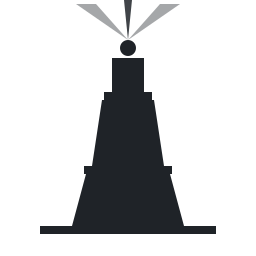

<p align="center">
  
</p>

# Pharos

A from-scratch Rust Ethereum proof-of-stake consensus client.

**Status: pre-alpha, M0 foundations complete.** Not usable as a node yet.
Currently passes 100% of Phase 0 SSZ static + generic conformance tests
across both `mainnet` and `minimal` presets. The chain logic (state
transition, fork choice, networking) is on the M1+ roadmap.

## Philosophy

> If consensus-specs publishes a conformance test suite for it, we own the
> implementation.

The SSZ codec, Merkleization, persistent collections, type containers, fork
choice, STF, networking glue, Beacon API, and Engine API client are all
in-house. Pharos leans on upstream crates only for generic infrastructure
(async runtime, p2p, storage, HTTP, serde) and for cryptographic primitives
where the conformance suite validates I/O but not side-channel safety
(BLS12-381, KZG).

Performance is a first-class goal: sync STF core with async I/O at the edges,
CoW-friendly persistent collections, no `clone()` on `BeaconState` in hot
paths, hardware crypto, `rayon` for embarrassingly parallel state operations.
We build bench-conscious; benchmarks come once there is something end-to-end
to measure.

## Workspace

```
crates/
  pharos-utils         # primitives (hashes, BLS, Uint256, newtypes)
  pharos-ssz           # in-house SSZ encode/decode + Merkleization
  pharos-ssz-derive    # #[derive(Encode, Decode, TreeHash)]
  pharos-types         # Phase 0 containers + EthSpec preset trait
  pharos-conformance   # spec-test runner + progress dashboard
  pharos-storage       # Store trait + rocksdb backend  (skeleton)
  pharos-fork-choice   # LMD-GHOST + FFG Casper          (skeleton)
  pharos-stf           # process_block / process_epoch   (skeleton)
  pharos-engine        # Engine API client (CL -> EL)    (skeleton)
  pharos-network       # libp2p + discv5 + gossip        (skeleton)
  pharos-api           # Beacon API HTTP server          (skeleton)
  pharos-node          # beacon-node binary `pharos`     (skeleton)
  pharos-validator     # validator-client binary `pharos-vc` (skeleton)
```

Two binaries from day one: `pharos` (beacon node) and `pharos-vc` (validator
client). Separation is mandatory for sane key handling and a clean Beacon API
boundary.

## Roadmap (abbreviated)

- **M0 — Foundations.** SSZ + Merkleization, persistent collections, BLS
  wrappers, Phase 0 containers, EthSpec, conformance harness. **Done.**
- **M1 — Phase 0 STF + fork choice.** `process_block`, `process_epoch`,
  LMD-GHOST, justification, finalization. Run `consensus-specs` STF tests
  until green.
- **M2 — Networking baseline.** `discv5`, `libp2p` gossipsub, req-resp.
- **M3 — Altair.** Sync committees, light-client protocol.
- **M4 — Bellatrix + Engine API.** First merged sync against a devnet.
- **M5–M10 — Capella, Deneb, Beacon API, validator client, Electra,
  Fulu (PeerDAS).**
- **M11 — Productionization.** Checkpoint sync, weak subjectivity, backfill,
  pruning, slasher, metrics.

Full roadmap: [`docs/roadmap.md`](docs/roadmap.md).

## Current conformance

Run the harness against the local fixtures cache:

```sh
scripts/fetch-spec-tests.sh                                  # one-time
cargo run -p pharos-conformance --release -- --fork phase0 --write
```

The result lands at [`docs/conformance.md`](docs/conformance.md) and is
committed to git so progress is visible in history. Categories not yet
implemented appear as `-` so the table doubles as a roadmap.

## Building

```sh
cargo build --workspace
cargo test --workspace
cargo clippy --workspace --all-targets -- -D warnings
cargo fmt --all -- --check
```

Rust 2024 edition, MSRV 1.85. No nightly features.

## Pairing

Pharos talks to an external execution layer via the Engine API. Planned
default pairing is [`ethrex`](https://github.com/lambdaclass/ethrex);
`reth` and `geth` should also work once `pharos-engine` is wired up.

## License

Dual-licensed under either of:

- Apache License, Version 2.0 ([LICENSE-APACHE](LICENSE-APACHE) or
  <https://www.apache.org/licenses/LICENSE-2.0>)
- MIT License ([LICENSE-MIT](LICENSE-MIT) or
  <https://opensource.org/licenses/MIT>)

at your option.
